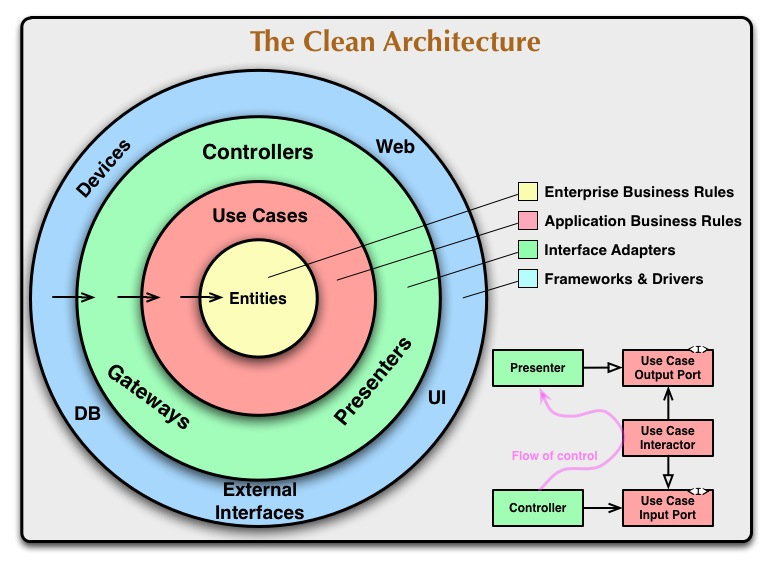

# Clean Architecture Definition

## SOLID principles
SOLID principles serve as guidelines for creating flexible and maintainable software. Each principle aims to facilitate robust design against changes and extensions, improving maintainability and reusability.

### SRP: Single Responsibility Principle (単一責任の原則)
A class should have only one responsibility, and there should be only one reason for it to change. This minimizes the impact of class changes on other parts of the system.

### OCP: Open-Closed Principle (オープン・クローズドの原則)
Software entities (classes, modules, functions, etc.) should be open for extension but closed for modification. Adding new features should be achieved through extension points without modifying existing code.

### LSP: Liskov Substitution Principle (リスコフの置換原則)
Subtypes (derived classes, implementing classes, etc.) should be substitutable for their base types. This means that subtypes can be used interchangeably with their base types without modifying the base type's code.

### ISP: Interface Segregation Principle (インターフェース分離の原則)
Clients should not be forced to depend on interfaces they do not use. Interfaces should be clearly defined based on the set of functionalities that clients require.

### DIP: Dependency Inversion Principle (依存関係逆転の原則)
High-level modules should not depend on low-level modules. Both should depend on abstractions. This principle promotes loose coupling by ensuring that dependencies are based on abstractions rather than concrete implementations.

## Layer Definition

### Core Business Rules

- Entities: 最重要なビジネスルールを格納する

### Application Business Rules

- Usecases
	- Use Case Interactor: EntityやInterface Adopterとの連携を行う
	- Input Boundary: Controllerからの入力をUse Case Interactorに経由するインターフェイス
	- Input Data: Controllerからの入力を格納するデータ構造
	- Output Boundary: Use Case Interactorからの出力をPresenterに経由するインターフェイス
	- Output Data: Use Case Interactorからの出力を格納するデータ構造
	- Data Access Interface: Databaseのデータを操作するインターフェイス

### Interface Adapters

- Controllers: Clientからの入力を処理しInput Boundaryを経由してUse Case Interaptorにデータを渡す
- Presenters: Use Case Interaptorからの出力をOutput Boundaryを経由して受取りView Modelに格納する
- View Model < DS >: Viewに表示するデータを格納
- Gateway/Repositories: Dataアクセスを処理

### Frameworks & Drivers

- UI
- Database
- Web
- Devices
- External Interfaces

## DI libraries for Typescript

You may consider integrating with Dependency Injection libraries as below for better orchestration.

- InversifyJS
- TSyringe

# Reference
- https://github.com/nenonaoki/clean-architecture-typescript/blob/main/README.md