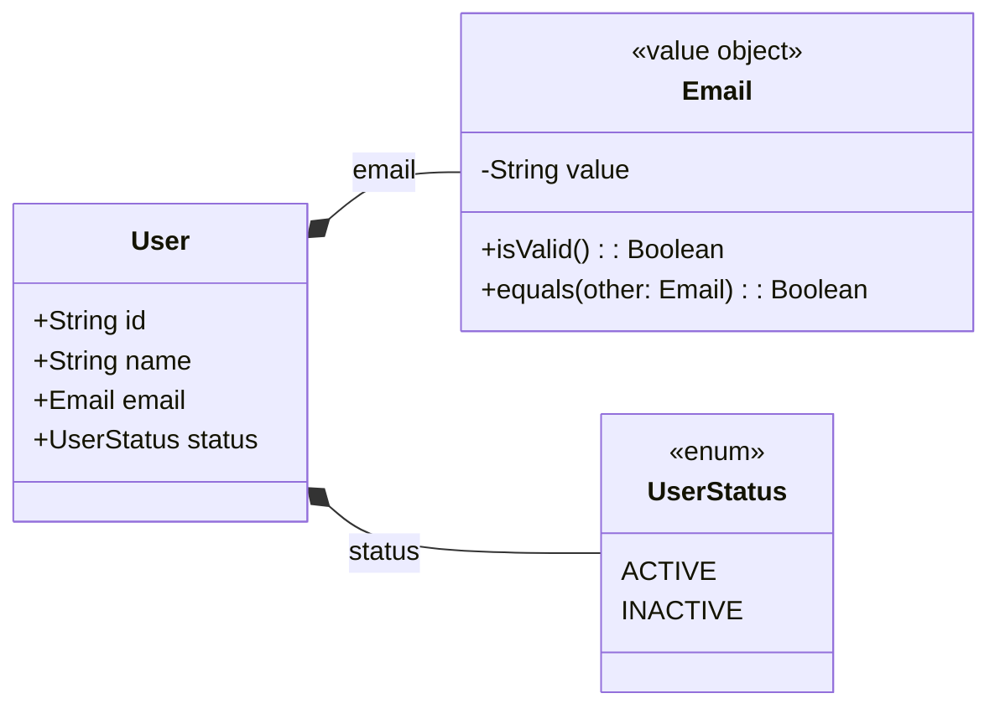

# User

## Diagram

## Rules

### User

* `name`: Defaults to `"user"`.
* `email`: Must be **unique across all users**. This is a business rule and is enforced outside the entity (e.g., in the use case or domain service).
* `status`: Defaults to `INACTIVE`.

### Email

* Has an `isValid()` method to perform syntax validation.
* Equality is determined using the `equals()` method.
* An empty email may be considered invalid and should be handled via a factory or service if necessary.

### UserStatus

* Only `ACTIVE` or `INACTIVE` are allowed.
* Only users with `ACTIVE` status can be used in other features (e.g., task assignment).
