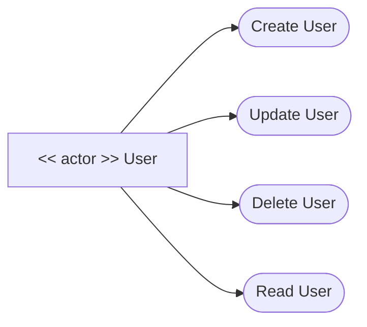

# User

```mermaid.js
%%{init: {'theme': 'default', 'flowchart': {'direction': 'LR'}}}%%
graph LR
  User[<< actor >> User] --> UC_Create([Create User])
  User --> UC_Update([Update User])
  User --> UC_Delete([Delete User])
  User --> UC_Read([Read User])
```

## Create User

## Update User

## Delete User

## Read User

